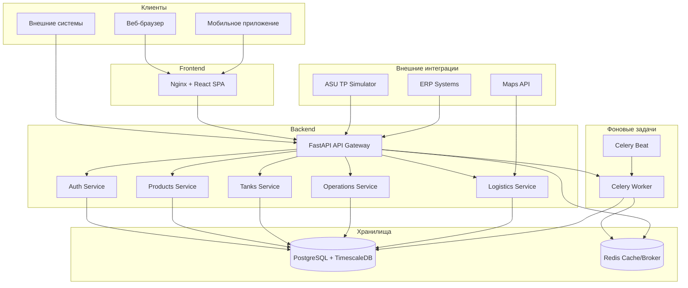

# FuelProcess SaaS Platform

Платформа для управления топливным процессингом: приём, переработка, хранение и отгрузка нефтепродуктов.

## 📋 Оглавление

- [Технологический стек](#технологический-стек)
- [Архитектура](#архитектура)
- [Быстрый старт](#быстрый-старт)
- [Пошаговая установка](#пошаговая-установка)
- [Запуск в разработке](#запуск-в-разработке)
- [Запуск в production](#запуск-в-production)
- [Первые шаги после запуска](#первые-шаги-после-запуска)
- [API Документация](#api-документация)
- [Тестирование](#тестирование)
- [Устранение проблем](#устранение-проблем)
- [Структура проекта](#структура-проекта)

## Технологический стек

### Backend
- **Python 3.12** - язык программирования
- **FastAPI 0.109** - веб-фреймворк
- **SQLAlchemy 2.0** - ORM
- **AsyncPG** - асинхронный драйвер PostgreSQL
- **Alembic** - миграции БД
- **Pydantic v2** - валидация данных
- **Celery 5.3** - фоновые задачи
- **Redis 7** - кэш и брокер сообщений
- **Passlib + Bcrypt** - хэширование паролей
- **Python-Jose** - JWT токены
- **Structlog** - структурированное логирование
- **SlowAPI** - rate limiting

### База данных
- **PostgreSQL 15 + TimescaleDB** - основное хранилище + временные ряды

### Frontend
- **React 18** - UI библиотека
- **TypeScript 5** - типизация
- **Vite 5** - сборщик
- **TailwindCSS 3** - стилизация
- **React Query (TanStack)** - управление состоянием сервера
- **React Hook Form** - формы
- **Recharts** - графики
- **Axios** - HTTP клиент

### Инфраструктура
- **Docker + Docker Compose** - контейнеризация
- **Nginx** - раздача статики и reverse proxy

## Архитектура



## Быстрый старт

### Требования
- Docker 24+
- Docker Compose 2.20+
- Git
- 4GB+ RAM
- 10GB+ свободного места на диске

### Установка за 5 минут

```bash
# 1. Клонируйте репозиторий
git clone <repository-url>
cd fuelprocess

# 2. Скопируйте .env файл
cp .env.example .env

# 3. Запустите все сервисы
docker-compose up -d

# 4. Дождитесь запуска (проверьте логи)
docker-compose logs -f backend

# 5. Откройте в браузере
# Frontend: http://localhost:3000
# Backend API: http://localhost:8000
# Swagger Docs: http://localhost:8000/api/v1/docs
```

### Данные для входа по умолчанию

| Роль | Логин | Пароль | Email |
|------|-------|--------|-------|
| Super Admin | admin | admin123 | admin@fuelprocess.com |
| Technologist | tech | tech123 | tech@fuelprocess.com |
| Storekeeper | storekeeper | store123 | store@fuelprocess.com |
| Logistician | logistician | logist123 | logistician@fuelprocess.com |
| Auditor | auditor | audit123 | auditor@fuelprocess.com |

## Пошаговая установка

### Шаг 1: Подготовка окружения

#### Для Linux/macOS

```bash
# Установите Docker
curl -fsSL https://get.docker.com -o get-docker.sh
sudo sh get-docker.sh

# Установите Docker Compose
sudo curl -L "https://github.com/docker/compose/releases/download/v2.24.0/docker-compose-$(uname -s)-$(uname -m)" -o /usr/local/bin/docker-compose
sudo chmod +x /usr/local/bin/docker-compose

# Проверьте установку
docker --version
docker-compose --version
```

#### Для Windows

1. Скачайте Docker Desktop с https://www.docker.com/products/docker-desktop
2. Установите и запустите Docker Desktop
3. Включите WSL2 backend в настройках

### Шаг 2: Клонирование проекта

```bash
git clone <repository-url> fuelprocess
cd fuelprocess
```

### Шаг 3: Настройка переменных окружения

```bash
# Скопируйте пример файла окружения
cp .env.example .env

# Отредактируйте .env файл
nano .env  # или используйте ваш любимый редактор
```

#### Обязательные переменные для изменения в production:

```env
# Безопасность - ОБЯЗАТЕЛЬНО измените!
SECRET_KEY=ваш-уникальный-секретный-ключ-минимум-32-символа

# База данных
POSTGRES_PASSWORD=надёжный-пароль-для-postgres

# Redis
REDIS_PASSWORD=надёжный-пароль-для-redis
```

### Шаг 4: Первый запуск

```bash
# Запустите все сервисы в фоновом режиме
docker-compose up -d

# Проверьте статус контейнеров
docker-compose ps

# Просмотрите логи backend
docker-compose logs -f backend

# Просмотрите логи базы данных
docker-compose logs -f postgres
```

### Шаг 5: Инициализация данных

После первого запуска автоматически создаются:
- Таблицы базы данных
- Пользователи по умолчанию
- Демо-данные (продукты, резервуары, установки)

Для ручной инициализации демо-данных:

```bash
docker-compose exec backend python -c "from app.services.seed_data import seed_demo_data; seed_demo_data()"
```

## Запуск в разработке

### Backend (локально без Docker)

```bash
# Перейдите в директорию backend
cd backend

# Создайте виртуальное окружение
python -m venv venv
source venv/bin/activate  # Linux/macOS
# или
venv\Scripts\activate  # Windows

# Установите зависимости
pip install -r requirements.txt

# Запустите базу данных и Redis через Docker
docker-compose up -d postgres redis

# Примените миграции
alembic upgrade head

# Запустите сервер разработки
uvicorn app.main:app --reload --host 0.0.0.0 --port 8000
```

### Frontend (локально без Docker)

```bash
# Перейдите в директорию frontend
cd frontend

# Установите зависимости
npm install

# Запустите сервер разработки
npm run dev

# Откройте http://localhost:3000
```

### Запуск Celery worker

```bash
# В отдельном терминале
cd backend
source venv/bin/activate

# Worker
celery -A app.core.celery_app worker --loglevel=info

# Beat (планировщик)
celery -A app.core.celery_app beat --loglevel=info
```

## Запуск в Production

### 1. Подготовка сервера

```bash
# Обновите систему
apt update && apt upgrade -y

# Установите Docker
curl -fsSL https://get.docker.com -o get-docker.sh
sh get-docker.sh

# Установите Docker Compose
curl -L "https://github.com/docker/compose/releases/download/v2.24.0/docker-compose-$(uname -s)-$(uname -m)" -o /usr/local/bin/docker-compose
chmod +x /usr/local/bin/docker-compose
```

### 2. Настройка безопасности

```bash
# Создайте пользователя для приложения
useradd -m -s /bin/bash fuelprocess

# Настройте firewall
ufw allow 22/tcp
ufw allow 80/tcp
ufw allow 443/tcp
ufw enable
```

### 3. Развёртывание

```bash
# Скопируйте файлы на сервер
scp -r . fuelprocess@your-server:/opt/fuelprocess

# Подключитесь к серверу
ssh fuelprocess@your-server
cd /opt/fuelprocess

# Настройте .env для production
nano .env

# Запустите в production режиме
docker-compose -f docker-compose.prod.yml up -d
```

### 4. Настройка Nginx как reverse proxy

```nginx
server {
    listen 80;
    server_name your-domain.com;

    location / {
        proxy_pass http://localhost:3000;
        proxy_set_header Host $host;
        proxy_set_header X-Real-IP $remote_addr;
        proxy_set_header X-Forwarded-For $proxy_add_x_forwarded_for;
        proxy_set_header X-Forwarded-Proto $scheme;
    }

    location /api {
        proxy_pass http://localhost:8000;
        proxy_set_header Host $host;
        proxy_set_header X-Real-IP $remote_addr;
    }
}
```

### 5. Настройка SSL (Let's Encrypt)

```bash
# Установите Certbot
apt install certbot python3-certbot-nginx -y

# Получите сертификат
certbot --nginx -d your-domain.com

# Автоматическое обновление
certbot renew --dry-run
```

## Первые шаги после запуска

### 1. Вход в систему

1. Откройте http://localhost:3000
2. Войдите под учётной записью admin/admin123
3. Смените пароль немедленно!

### 2. Настройка справочников

1. Перейдите в раздел "Справочники"
2. Добавьте единицы измерения
3. Настройте коэффициенты ГОСТ

### 3. Создание продуктов

1. Перейдите в "Продукция" → "Добавить продукт"
2. Заполните параметры:
   - Наименование
   - Плотность (кг/м³ при 20°C)
   - Тип продукта
   - Содержание серы (%)
   - Октановое/цетановое число

### 4. Добавление резервуаров

1. Перейдите в "Резервуарный парк" → "Добавить резервуар"
2. Укажите:
   - Название (например, "РВС-1000 №1")
   - Вместимость (м³)
   - Максимальный уровень (м)

### 5. Создание первой операции приёма

1. Перейдите в "Операции" → "Приход"
2. Выберите продукт и резервуар
3. Укажите объём и температуру
4. Масса рассчитается автоматически по формуле ГОСТ

## API Документация

### Основные эндпоинты

#### Аутентификация
```bash
# Регистрация
POST /api/v1/auth/register
{
  "email": "user@example.com",
  "username": "newuser",
  "password": "securepassword",
  "role": "storekeeper"
}

# Вход
POST /api/v1/auth/login?email=user@example.com&password=securepassword

# Обновление токена
POST /api/v1/auth/refresh

# Информация о текущем пользователе
GET /api/v1/auth/me
```

#### Продукты
```bash
# Список продуктов
GET /api/v1/products?skip=0&limit=100

# Создание продукта
POST /api/v1/products
{
  "name": "АИ-95",
  "density": 750.0,
  "product_type": "gasoline",
  "octane_number": 95,
  "sulfur_content": 0.001
}

# Обновление продукта
PUT /api/v1/products/{id}
{
  "density": 755.0
}
```

#### Резервуары
```bash
# Список резервуаров
GET /api/v1/tanks

# Данные резервуара
GET /api/v1/tanks/{id}

# История измерений (TimescaleDB)
GET /api/v1/tanks/{id}/measurements?hours=24
```

#### Операции
```bash
# Приход топлива
POST /api/v1/operations/receipt
{
  "batch_id": 1,
  "tank_id": 1,
  "source_type": "tanker",
  "volume_m3": 500.0,
  "temperature_celsius": 25.0
}

# Расход топлива
POST /api/v1/operations/consumption
{
  "tank_id": 1,
  "product_id": 1,
  "volume_m3": 100.0,
  "consumption_type": "shipment"
}
```

#### Баланс
```bash
# Расчёт материального баланса
POST /api/v1/balance/calculate
{
  "inputs": [
    {"product_id": 1, "mass_kg": 10000}
  ],
  "outputs": [
    {"product_id": 2, "mass_kg": 4500},
    {"product_id": 3, "mass_kg": 3500}
  ]
}
```

### Swagger UI

Откройте http://localhost:8000/api/v1/docs для интерактивной документации.

## Тестирование

### Backend тесты

```bash
# Запустить все тесты
docker-compose exec backend pytest

# Запустить с покрытием
docker-compose exec backend pytest --cov=app --cov-report=html

# Запустить конкретный тест
docker-compose exec backend pytest tests/unit/test_auth.py -v

# Запустить интеграционные тесты
docker-compose exec backend pytest tests/integration/ -v
```

### Frontend тесты

```bash
# Запустить тесты
docker-compose exec frontend npm test

# Запустить с покрытием
docker-compose exec frontend npm test -- --coverage
```

### Проверка покрытия

Целевое покрытие: **70%+** для критических модулей:
- `app/services/balance_calculator.py`
- `app/services/tank_operations.py`
- `app/middleware/audit.py`

## Устранение проблем

### Частые проблемы и решения

#### 1. Контейнер не запускается

```bash
# Проверьте логи
docker-compose logs backend

# Пересоздайте контейнер
docker-compose down
docker-compose up -d --force-recreate backend
```

#### 2. Ошибка подключения к базе данных

```bash
# Проверьте, что БД запущена
docker-compose ps postgres

# Проверьте логи БД
docker-compose logs postgres

# Убедитесь, что DATABASE_URL корректен
docker-compose exec backend env | grep DATABASE
```

#### 3. Миграции не применяются

```bash
# Примените миграции вручную
docker-compose exec backend alembic upgrade head

# Проверьте статус миграций
docker-compose exec backend alembic current
```

#### 4. Redis не доступен

```bash
# Перезапустите Redis
docker-compose restart redis

# Проверьте подключение
docker-compose exec backend redis-cli -h redis ping
```

#### 5. Frontend не видит backend

```bash
# Проверьте CORS настройки в .env
# CORS_ORIGINS должен включать адрес frontend

# Проверьте VITE_API_URL в frontend/.env
echo $VITE_API_URL
```

#### 6. Celery worker не обрабатывает задачи

```bash
# Проверьте логи worker
docker-compose logs celery-worker

# Отправьте тестовую задачу
docker-compose exec backend python -c "from app.core.tasks import cleanup_old_audit_logs; cleanup_old_audit_logs.delay(30)"
```

### Логи

```bash
# Все логи
docker-compose logs -f

# Только backend
docker-compose logs -f backend

# Только errors (если настроено)
docker-compose exec backend tail -f /var/log/app/error.log
```

### Мониторинг

```bash
# Статус всех сервисов
docker-compose ps

# Использование ресурсов
docker stats

# Проверка здоровья
curl http://localhost:8000/api/v1/health
```

## Структура проекта

```
fuelprocess/
├── backend/
│   ├── app/
│   │   ├── api/
│   │   │   └── v1/
│   │   │       ├── endpoints/
│   │   │       │   ├── auth.py
│   │   │       │   ├── products.py
│   │   │       │   ├── tanks.py
│   │   │       │   ├── operations.py
│   │   │       │   ├── logistics.py
│   │   │       │   ├── dashboard.py
│   │   │       │   └── audit.py
│   │   │       └── router.py
│   │   ├── core/
│   │   │   ├── config.py
│   │   │   ├── security.py
│   │   │   ├── jwt.py
│   │   │   ├── celery_app.py
│   │   │   └── tasks.py
│   │   ├── db/
│   │   │   └── session.py
│   │   ├── models/
│   │   │   └── __init__.py
│   │   ├── schemas/
│   │   │   └── __init__.py
│   │   ├── services/
│   │   ├── utils/
│   │   │   └── auth.py
│   │   └── main.py
│   ├── alembic/
│   │   ├── versions/
│   │   └── env.py
│   ├── tests/
│   │   ├── unit/
│   │   └── integration/
│   ├── requirements.txt
│   └── Dockerfile
├── frontend/
│   ├── src/
│   │   ├── components/
│   │   ├── context/
│   │   ├── hooks/
│   │   ├── pages/
│   │   ├── services/
│   │   └── types/
│   ├── package.json
│   ├── tsconfig.json
│   ├── vite.config.ts
│   └── Dockerfile
├── scripts/
│   └── init_db.sql
├── docker-compose.yml
├── .env
├── .env.example
├── Makefile
└── README.md
```

## Makefile команды

```bash
make up          # Запустить все сервисы
make down        # Остановить все сервисы
make build       # Пересобрать образы
make logs        # Просмотр логов
make test        # Запустить тесты
make migrate     # Применить миграции
make seed        # Загрузить демо-данные
make shell-backend   # Войти в контейнер backend
make shell-frontend  # Войти в контейнер frontend
make clean       # Очистить всё (включая volumes)
```

## Безопасность

### Рекомендации

1. **Измените все пароли по умолчанию** перед production развёртыванием
2. **Используйте HTTPS** в production
3. **Регулярно обновляйте** зависимости
4. **Настройте backup** базы данных
5. **Ограничьте доступ** к административным эндпоинтам
6. **Используйте secrets management** для чувствительных данных

### Ролевая модель

| Роль | Права доступа |
|------|--------------|
| super_admin | Полный доступ ко всем функциям |
| tech | Процессинг, балансы, отчёты |
| storekeeper | Приход/расход, резервуары |
| logistician | Заявки, транспорт, отгрузки |
| auditor | Только чтение всех данных |

## Лицензия

Proprietary software. Все права защищены.

## Контакты

- Техническая поддержка: support@fuelprocess.com
- Документация: https://docs.fuelprocess.com